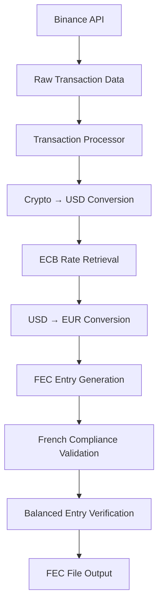
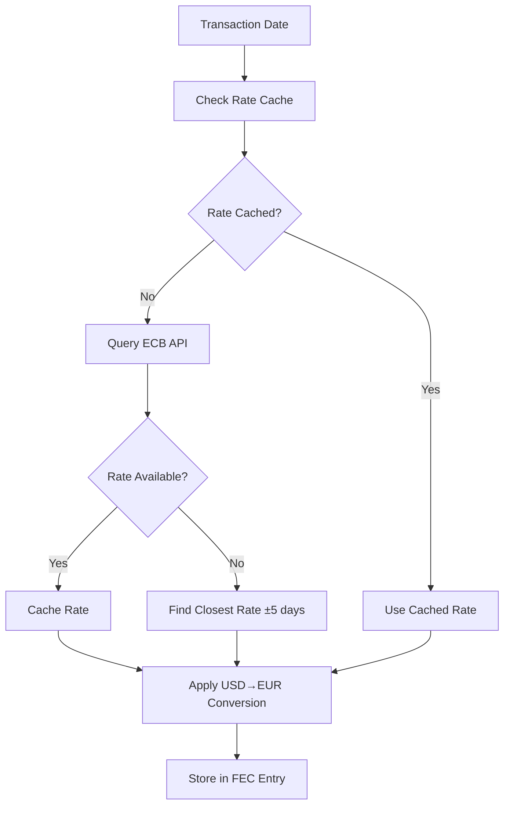

# Design Document

## Overview

The Binance FEC Extractor is a Python application that connects to the Binance API to retrieve cryptocurrency transactions and formats them according to French FEC (Fichier des Écritures Comptables) accounting standards. The application will handle authentication, data extraction, currency conversion, and double-entry bookkeeping formatting to produce compliant accounting records.

## Architecture

The application follows a modular architecture with clear separation of concerns:

```
binance_fec_extractor/
├── main.py                 # Entry point and CLI interface
├── config/
│   ├── __init__.py
│   ├── settings.py         # Configuration management
│   └── accounts.py         # FEC account mapping
├── api/
│   ├── __init__.py
│   ├── binance_client.py   # Binance API wrapper
│   └── exchange_rates.py   # Currency conversion service
├── processors/
│   ├── __init__.py
│   ├── transaction_processor.py  # Transaction processing logic
│   └── fec_formatter.py    # FEC format generation
├── models/
│   ├── __init__.py
│   ├── database.py         # SQLAlchemy database setup
│   ├── transaction.py      # Transaction SQLAlchemy models
│   └── fec_entry.py        # FEC entry SQLAlchemy model
└── utils/
    ├── __init__.py
    ├── logger.py           # Logging utilities
    └── validators.py       # Input validation
```

## Components and Interfaces

### 1. Main Application (main.py)
- **Purpose**: Entry point, CLI argument parsing, orchestration
- **Key Functions**:
  - `main()`: Application entry point
  - `parse_arguments()`: Command line argument parsing
  - `validate_inputs()`: Input validation
- **Dependencies**: All other modules

### 2. Configuration Management (config/)

#### settings.py
- **Purpose**: Application configuration and environment variable handling
- **Key Classes**:
  - `Config`: Main configuration class
- **Key Functions**:
  - `load_config()`: Load configuration from file/environment
  - `validate_api_credentials()`: Validate Binance API credentials

#### accounts.py
- **Purpose**: FEC account number mapping and definitions
- **Key Constants**:
  - `CRYPTO_ACCOUNTS`: Mapping of cryptocurrencies to account numbers
  - `SYSTEM_ACCOUNTS`: Standard accounting accounts (580, 6278, etc.)
- **Key Functions**:
  - `get_crypto_account()`: Get account number for cryptocurrency
  - `get_system_account()`: Get system account numbers

### 3. API Layer (api/)

#### binance_client.py
- **Purpose**: Binance API interaction wrapper
- **Key Classes**:
  - `BinanceClient`: Main API client
- **Key Functions**:
  - `authenticate()`: API authentication
  - `get_account_info()`: Retrieve account information
  - `get_trades()`: Retrieve trading history
  - `get_deposits()`: Retrieve deposit history
  - `get_withdrawals()`: Retrieve withdrawal history
  - `get_dust_log()`: Retrieve dust conversion history
- **Rate Limiting**: Implements exponential backoff and request throttling

#### exchange_rates.py
- **Purpose**: Historical exchange rate retrieval with ECB API integration
- **Key Classes**:
  - `ExchangeRateService`: Exchange rate management
  - `ECBClient`: European Central Bank API client
- **Key Functions**:
  - `get_ecb_usd_eur_rate()`: Get USD/EUR rate from ECB API for specific date
  - `get_crypto_usd_rate()`: Get cryptocurrency to USD rate
  - `convert_crypto_to_usd()`: Convert crypto amount to USD
  - `convert_usd_to_eur()`: Convert USD to EUR using ECB rates
  - `cache_ecb_rates()`: Cache ECB rates locally to minimize API calls
  - `get_closest_rate()`: Get closest available rate within 5 business days
- **Data Sources**: Primary ECB API, fallback sources (CoinGecko, Coinbase)
- **Rate Conversion Flow**: Crypto → USD → EUR (using ECB rates)

### 4. Processing Layer (processors/)

#### transaction_processor.py
- **Purpose**: Business logic for transaction processing
- **Key Classes**:
  - `TransactionProcessor`: Main processing engine
- **Key Functions**:
  - `process_trades()`: Process trading transactions
  - `process_deposits()`: Process deposit transactions
  - `process_withdrawals()`: Process withdrawal transactions
  - `process_fees()`: Process fee transactions
  - `create_double_entries()`: Generate double-entry bookkeeping records

#### fec_formatter.py
- **Purpose**: FEC format generation and French legal compliance
- **Key Classes**:
  - `FECFormatter`: FEC format generator with French legal compliance
  - `FrenchFECValidator`: Validator for French legal requirements
- **Key Functions**:
  - `format_entry()`: Format single FEC entry with USD values and ECB rates
  - `generate_fec_file()`: Generate complete FEC file in French legal format
  - `validate_french_compliance()`: Validate compliance with Article A47 A-1
  - `ensure_balanced_entries()`: Ensure total debits equal total credits
  - `format_sequential_numbers()`: Generate sequential EcritureNum within journals
  - `format_french_dates()`: Format dates as YYYYMMDD (French standard)
  - `format_french_amounts()`: Format amounts with period decimal separator
  - `validate_chart_of_accounts()`: Validate French Chart of Accounts numbering

### 5. Data Models (models/)

#### database.py
- **Purpose**: SQLAlchemy database configuration and session management
- **Key Classes**:
  - `DatabaseManager`: Database connection and session management
- **Key Functions**:
  - `init_database()`: Initialize database and create tables
  - `get_session()`: Get database session
  - `close_session()`: Close database session

#### transaction.py
- **Purpose**: Transaction SQLAlchemy models
- **Key Classes**:
  - `Transaction`: Base transaction SQLAlchemy model
  - `Trade`: Trading transaction model (inherits from Transaction)
  - `Deposit`: Deposit transaction model (inherits from Transaction)
  - `Withdrawal`: Withdrawal transaction model (inherits from Transaction)
  - `Fee`: Fee transaction model (inherits from Transaction)
- **Relationships**: Proper foreign key relationships and indexes

#### fec_entry.py
- **Purpose**: FEC entry SQLAlchemy model
- **Key Classes**:
  - `FECEntry`: FEC record SQLAlchemy model with all required fields
- **Relationships**: Links to Transaction model for traceability

### 6. Utilities (utils/)

#### logger.py
- **Purpose**: Logging configuration and utilities
- **Key Functions**:
  - `setup_logger()`: Configure application logging
  - `log_api_call()`: Log API interactions (without sensitive data)

#### validators.py
- **Purpose**: Input validation utilities
- **Key Functions**:
  - `validate_date_range()`: Validate date inputs
  - `validate_api_credentials()`: Validate API key format
  - `validate_output_path()`: Validate output file path

## Data Flow and Processing Pipeline

### Transaction Processing Flow


### Exchange Rate Processing Flow


### FEC Entry Generation Process
1. **Transaction Analysis**: Determine transaction type and required accounts
2. **USD Conversion**: Convert crypto amounts to USD using market rates
3. **ECB Rate Lookup**: Get official USD/EUR rate for transaction date
4. **EUR Conversion**: Calculate EUR amounts using ECB rates
5. **Double-Entry Creation**: Generate balanced debit/credit entries
6. **French Formatting**: Apply French legal format requirements
7. **Compliance Validation**: Verify Article A47 A-1 compliance
8. **Sequential Numbering**: Assign sequential EcritureNum within journal

## Data Models

### Transaction SQLAlchemy Model
```python
from sqlalchemy import Column, Integer, String, DateTime, Numeric, ForeignKey
from sqlalchemy.ext.declarative import declarative_base
from sqlalchemy.orm import relationship

Base = declarative_base()

class Transaction(Base):
    __tablename__ = 'transactions'
    
    id = Column(Integer, primary_key=True)
    binance_id = Column(String, unique=True, nullable=False)
    timestamp = Column(DateTime, nullable=False)
    symbol = Column(String, nullable=False)
    side = Column(String)  # BUY/SELL
    quantity = Column(Numeric(precision=18, scale=8))
    price = Column(Numeric(precision=18, scale=8))
    commission = Column(Numeric(precision=18, scale=8))
    commission_asset = Column(String)
    transaction_type = Column(String, nullable=False)  # TRADE/DEPOSIT/WITHDRAWAL
    
    # Relationship to FEC entries
    fec_entries = relationship("FECEntry", back_populates="transaction")

class Trade(Transaction):
    __tablename__ = 'trades'
    id = Column(Integer, ForeignKey('transactions.id'), primary_key=True)
    __mapper_args__ = {'polymorphic_identity': 'TRADE'}

class Deposit(Transaction):
    __tablename__ = 'deposits'
    id = Column(Integer, ForeignKey('transactions.id'), primary_key=True)
    network = Column(String)
    address = Column(String)
    __mapper_args__ = {'polymorphic_identity': 'DEPOSIT'}

class Withdrawal(Transaction):
    __tablename__ = 'withdrawals'
    id = Column(Integer, ForeignKey('transactions.id'), primary_key=True)
    network = Column(String)
    address = Column(String)
    __mapper_args__ = {'polymorphic_identity': 'WITHDRAWAL'}
```

### FEC Entry SQLAlchemy Model
```python
class FECEntry(Base):
    __tablename__ = 'fec_entries'
    
    id = Column(Integer, primary_key=True)
    transaction_id = Column(Integer, ForeignKey('transactions.id'))
    
    # French FEC mandatory fields (Article A47 A-1 compliance)
    journal_code = Column(String, default="BIN")
    journal_lib = Column(String, default="BINANCE")
    ecriture_num = Column(Integer, nullable=False)  # Sequential within journal
    ecriture_date = Column(String, nullable=False)  # YYYYMMDD format
    compte_num = Column(String, nullable=False)  # French Chart of Accounts
    compte_lib = Column(String, nullable=False)
    comp_aux_num = Column(String, default="")
    comp_aux_lib = Column(String, default="")
    piece_ref = Column(String, nullable=False)
    piece_date = Column(String, nullable=False)  # YYYYMMDD format
    ecriture_lib = Column(String, nullable=False)
    debit = Column(String, default="")  # EUR amount with period decimal
    credit = Column(String, default="")  # EUR amount with period decimal
    ecriture_let = Column(String, default="")
    date_let = Column(String, default="")
    valid_date = Column(String, default="")
    
    # USD and exchange rate fields (Requirements 9)
    montant_devise = Column(String, nullable=False)  # USD amount
    idevise = Column(String, default="USD")  # Always USD
    taux_de_change = Column(String, nullable=False)  # ECB USD/EUR rate
    
    # Platform and traceability fields
    nom_plateforme_blockchain = Column(String, default="binance")
    cump = Column(String)  # Crypto unit market price in USD
    devise_ecart_convertion = Column(String, default="")
    adresse_source = Column(String, default="")
    adresse_destination = Column(String, default="")
    id_transaction_comptacrypto = Column(String, default="")
    
    # Additional fields for compliance tracking
    ecb_rate_date = Column(String)  # Date of ECB rate used
    conversion_method = Column(String, default="ECB")  # Rate source used
    
    # Relationship back to transaction
    transaction = relationship("Transaction", back_populates="fec_entries")
```

## Error Handling

### API Error Handling
- **Rate Limiting**: Implement exponential backoff with jitter
- **Network Errors**: Retry logic with maximum attempts
- **Authentication Errors**: Clear error messages and credential validation
- **Data Errors**: Validation and sanitization of API responses

### Data Processing Errors
- **Missing Exchange Rates**: Fallback to alternative sources or manual input
- **Invalid Transactions**: Log and skip with detailed error reporting
- **File I/O Errors**: Graceful handling with alternative output locations

### User Input Errors
- **Invalid Dates**: Clear format requirements and examples
- **Missing Credentials**: Step-by-step setup instructions
- **Invalid Paths**: Path validation and suggestions

## Testing Strategy

### Unit Tests
- **API Client**: Mock Binance API responses
- **SQLAlchemy Models**: Test model relationships and constraints
- **Transaction Processor**: Test all transaction types and edge cases
- **FEC Formatter**: Validate French legal compliance and format requirements
- **ECB Exchange Rate Service**: Test ECB API integration and rate caching
- **French Compliance Validator**: Test Article A47 A-1 compliance
- **USD Conversion Logic**: Test crypto → USD → EUR conversion chain
- **Database Operations**: Test CRUD operations and queries
- **Validators**: Test all validation scenarios including French format requirements

### Integration Tests
- **End-to-End**: Full workflow with test data including ECB rate integration
- **API Integration**: Test with Binance testnet and ECB API
- **French FEC Compliance**: Validate generated files against French tax authority requirements
- **File Output**: Validate generated FEC files for legal compliance
- **Exchange Rate Integration**: Test ECB API integration and fallback mechanisms
- **Error Scenarios**: Test error handling paths including ECB API failures

### Test Data
- **Sample Transactions**: Representative transaction sets
- **Edge Cases**: Unusual transaction types and amounts
- **Historical Data**: Various date ranges and periods
- **Error Conditions**: Invalid API responses and network issues

## French Legal Compliance

### Article A47 A-1 Compliance
The application ensures full compliance with French General Tax Code Article A47 A-1:

#### File Format Requirements
- **Format**: Tab-separated values (.txt) as mandated by French tax authorities
- **Encoding**: UTF-8 encoding for proper character handling
- **Column Order**: Exact 25-column order as specified in regulations
- **Field Validation**: All mandatory fields properly populated

#### Date Format Standards
- **Format**: YYYYMMDD without separators (e.g., "20231215")
- **Consistency**: All date fields use identical format
- **Validation**: Date format validation before file generation

#### Amount Format Standards
- **Decimal Separator**: Period (.) as decimal separator (not comma)
- **Precision**: Appropriate decimal precision for EUR amounts
- **Validation**: Numeric format validation for all amount fields

#### Chart of Accounts Compliance
- **Numbering**: French Chart of Accounts (Plan Comptable Général) system
- **Account Categories**:
  - 5220xxx: Cryptocurrency holdings accounts
  - 580: Internal bank movements
  - 6278: Commission expenses
  - 767004: Gains on token sales
  - 667004: Losses on token sales

#### Journal Entry Requirements
- **Sequential Numbering**: EcritureNum sequential within each journal
- **Balanced Entries**: Total debits must equal total credits
- **Double-Entry**: All transactions follow double-entry bookkeeping
- **Traceability**: Complete audit trail with transaction references

### ECB Exchange Rate Integration

#### Rate Source Requirements
- **Primary Source**: European Central Bank (ECB) free API
- **Rate Type**: Official USD/EUR exchange rates
- **Date Matching**: Rates matched to transaction dates
- **Fallback Logic**: Closest available rate within 5 business days

#### Conversion Process
1. **Crypto → USD**: Convert cryptocurrency amount to USD using market rates
2. **USD → EUR**: Convert USD to EUR using ECB official rates
3. **Rate Storage**: Store both USD amount and ECB rate in FEC entry
4. **Validation**: Ensure conversion accuracy and rate availability

#### Rate Caching Strategy
- **Local Cache**: Cache ECB rates to minimize API calls
- **Cache Duration**: Daily rates cached for 24 hours
- **Cache Validation**: Verify cached rates are current
- **Fallback Handling**: Alternative sources when ECB unavailable

## Security Considerations

### API Security
- **Credential Storage**: Environment variables or secure config files
- **API Permissions**: Read-only permissions only
- **Logging**: Never log sensitive credentials or private keys
- **Rate Limiting**: Respect Binance API limits

### Data Security
- **Local Storage**: Secure temporary file handling
- **Output Files**: Appropriate file permissions
- **Memory Management**: Clear sensitive data from memory
- **Error Messages**: Avoid exposing sensitive information

## Performance Considerations

### API Optimization
- **Batch Requests**: Minimize API calls through batching
- **Caching**: Cache exchange rates and account information
- **Pagination**: Handle large datasets efficiently
- **Parallel Processing**: Concurrent API calls where appropriate

### Memory Management
- **Database Pagination**: Use SQLAlchemy pagination for large datasets
- **Batch Processing**: Process transactions in batches using SQLAlchemy bulk operations
- **Connection Pooling**: Efficient database connection management
- **Query Optimization**: Use SQLAlchemy query optimization and indexing

## Configuration Options

### Required Configuration
- `BINANCE_API_KEY`: Binance API key
- `BINANCE_SECRET_KEY`: Binance secret key
- `START_DATE`: Transaction start date (YYYY-MM-DD)
- `END_DATE`: Transaction end date (YYYY-MM-DD)

### Optional Configuration
- `OUTPUT_DIR`: Output directory (default: current directory)
- `LOG_LEVEL`: Logging level (default: INFO)
- `EXCHANGE_RATE_SOURCE`: Primary exchange rate source
- `MAX_RETRIES`: Maximum API retry attempts
- `RATE_LIMIT_DELAY`: Delay between API calls

### Configuration File Format (config.json)
```json
{
  "api": {
    "base_url": "https://api.binance.com",
    "timeout": 30,
    "max_retries": 3,
    "rate_limit_delay": 0.1
  },
  "output": {
    "directory": "./output",
    "filename_template": "binance_fec_{start_date}_{end_date}.txt",
    "french_compliance": true
  },
  "exchange_rates": {
    "primary_source": "ecb",
    "ecb_api_url": "https://sdw-wsrest.ecb.europa.eu/service/data/EXR/D.USD.EUR.SP00.A",
    "fallback_sources": ["exchangerate-api", "freecurrency-api", "coinbase"],
    "cache_duration": 86400,
    "max_rate_age_days": 5
  },
  "french_fec": {
    "journal_code": "BIN",
    "journal_lib": "BINANCE",
    "validate_compliance": true,
    "enforce_balance": true,
    "date_format": "YYYYMMDD",
    "decimal_separator": ".",
    "platform_name": "binance"
  }
}
```
## Data
base Schema

### Database Configuration
- **Engine**: SQLite for local development, PostgreSQL for production
- **Connection Pooling**: SQLAlchemy connection pooling for performance
- **Migrations**: Alembic for database schema migrations
- **Indexing**: Proper indexes on timestamp, symbol, and transaction_type fields

### Data Persistence Strategy
- **Transaction Storage**: All Binance transactions stored in normalized tables
- **FEC Generation**: FEC entries generated from stored transactions
- **Incremental Updates**: Support for incremental data extraction
- **Data Integrity**: Foreign key constraints and validation rules

### Required Dependencies
```
sqlalchemy>=2.0.0
alembic>=1.12.0
psycopg2-binary>=2.9.0  # For PostgreSQL support
```